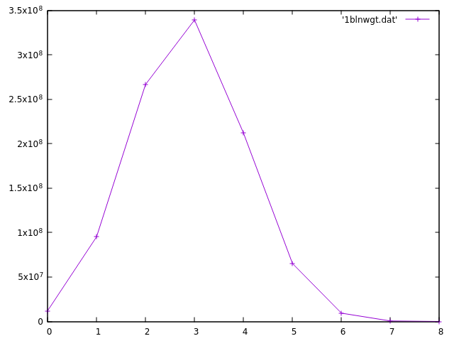

# Pilot Problem
## *Simulation and Visualization Of The AP Statistics Intro Problem*

### Sample Data:

*1 Billion Simulations*

#### Raw Table
Gathered using the weighted C++ simulation. From [the dat file located in the data directory](https://github.com/drewrip/PilotProblem/blob/master/data/1blnwgt.dat).

| # of Female Pilots | # of Simulations |
|--------------------|------------------|
| 0                  | 11898204         |
| 1                  | 95195235         |
| 2                  | 266538338        |
| 3                  | 339241813        |
| 4                  | 212016498        |
| 5                  | 65249781         |
| 6                  | 9318613          |
| 7                  | 533349           |
| 8                  | 8169             |

#### Graph

### Info:

Two versions of the simulation were created. [One written in Python](simplepilots.py) and [one written in C++](weightedpilots.cpp). The Python version tries to simulate the original method of picking pilots by choosing names out of a hat. It is a bit more computationally and memory intensive, as it picks and removes words out of an array. The C++ version uses an optimized version of the original method. It uses weighted random numbers that change after choices. This method at running the simulation is more efficient and recommended. 

Try the [Python method online](https://repl.it/repls/TealDarkcyanApplicationprogrammer) or [the optimized C++ version](https://repl.it/repls/ResponsibleWrathfulLicense).
